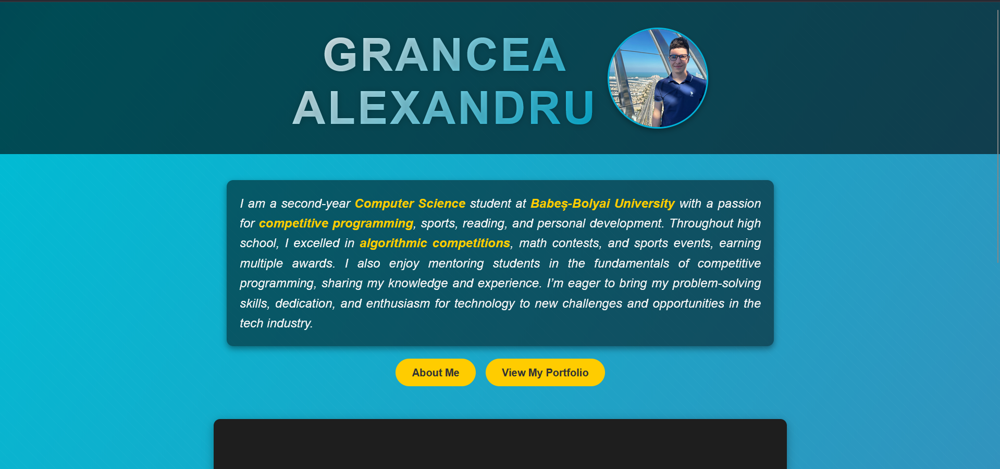
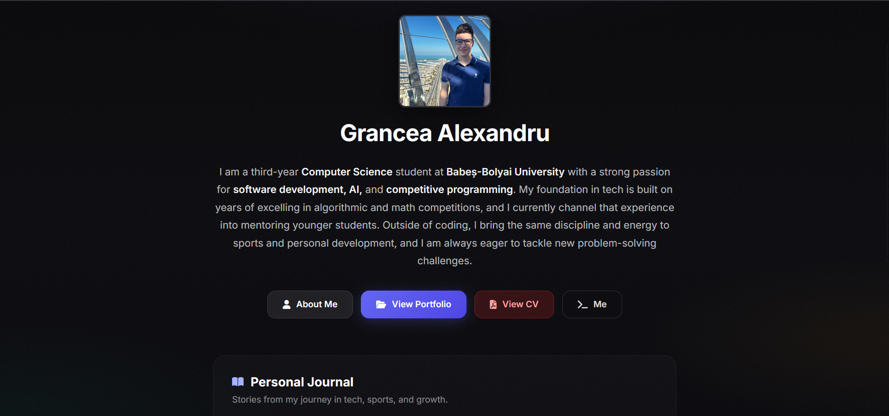

# CV Site

Welcome to my CV Site repository! This project is a personal website designed to showcase my journey in computer science, my achievements, and my projects. The site features a dynamic portfolio, a personal journal, a View CV button, and responsive design to ensure a seamless experience across all devices.

🖥 **Live Demo:** [Visit My CV Website](https://agportfolio-a13e2a8e20e4.herokuapp.com/)

## Screenshots

| First Version | Final Version |
|---------------|---------------|
|  |  |

## Features
- **Responsive Design:** Optimized for desktops, tablets, and mobile devices.
- **Dynamic Portfolio:** Projects grouped by year with tech stack badges and links to GitHub.
- **Personal Journal:** Blog-style entries about your journey in tech, sports, and growth.
- **View CV:** PDF resume opens in a new tab.
- **Modern Styling:** Dark theme, glassmorphism panels, gradient accents, and smooth animations.
- **About Me:** Story, achievements, and links to GitHub and LinkedIn.
- **Terminal-style "Me" popup:** Quick overview with status, skills, achievements, and connect info.

## Technologies Used
- **Django:** Python-based web framework.
- **HTML & CSS:** Modern responsive design with flexbox, CSS variables, and custom styling.
- **JavaScript:** Interactivity for the terminal popup and journal animations.

